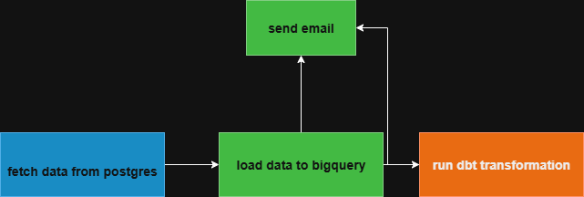

# HR Data Pipeline (PostgreSQL → BigQuery with dbt & Airflow)

## Overview
This project demonstrates an ETL pipeline that extracts HR data from PostgreSQL, loads it into Google BigQuery, and applies dbt transformations and tests. The entire pipeline is automated and orchestrated with Apache Airflow.

## Workflow
1. Extract data from PostgreSQL and save it into a CSV file.
2. Load the CSV into BigQuery.
3. Run dbt models for data transformation.
4. Run dbt tests for data quality checks.
5. Send failure alerts via email using Airflow.

## Tech Stack
- Python (pandas, psycopg2, google-cloud-bigquery)
- Apache Airflow
- PostgreSQL
- Google BigQuery
- dbt

## Pipeline Diagram

